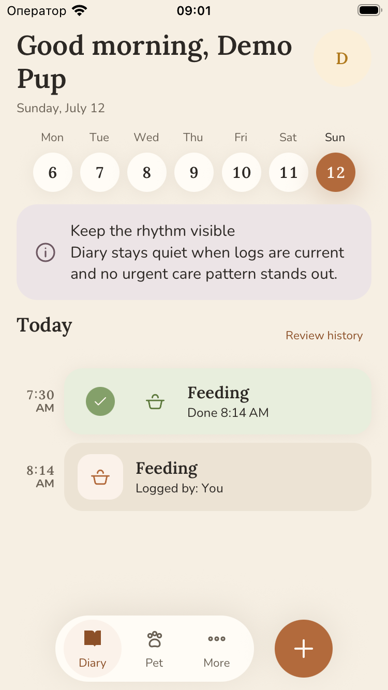
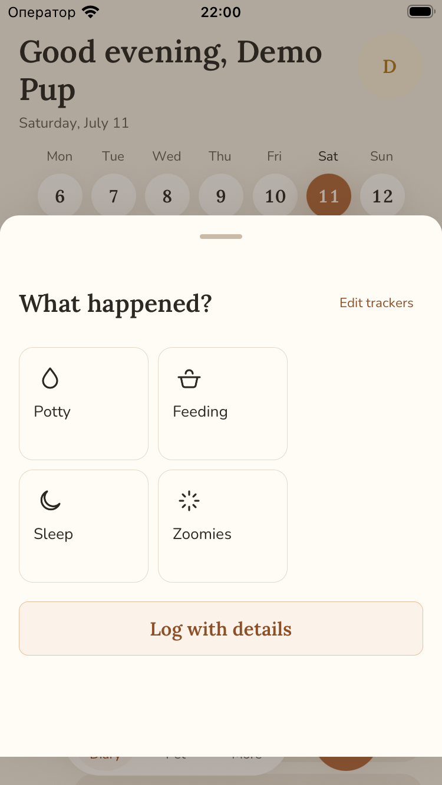
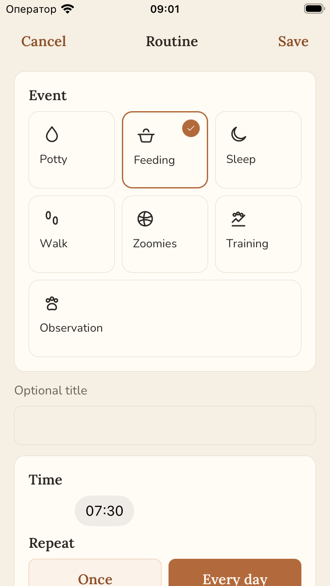
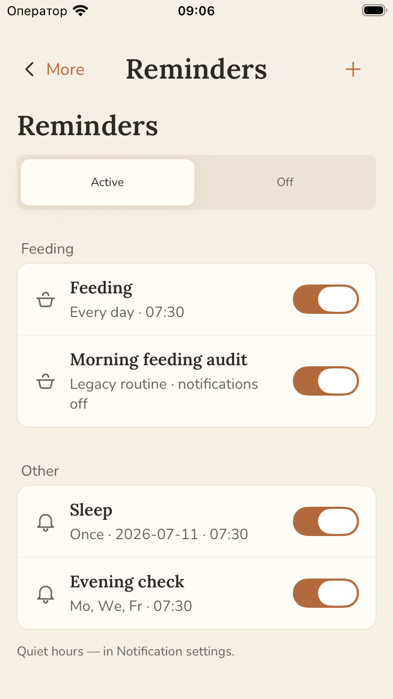
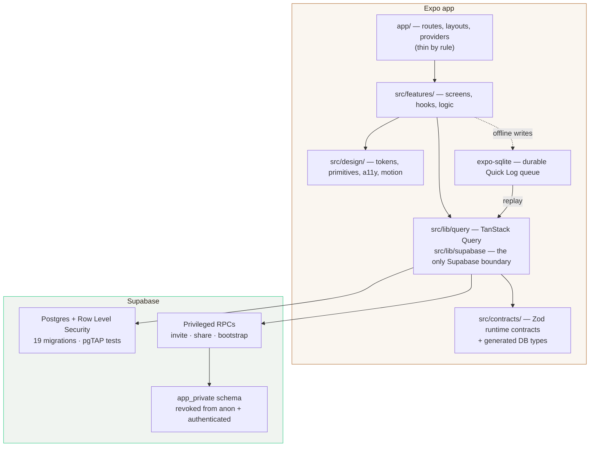

# PuppyPlan

A native iOS and Android app for the first 90 days with a puppy — log what happened in about
five seconds, see the day as a plan you can actually keep, and share the right slice of it with
the people who help.

[](LICENSE)
[](https://expo.dev)
[](https://reactnative.dev)
[](tsconfig.json)
[](supabase/)

| Diary | Quick Log | Routine | Reminders |
|:--:|:--:|:--:|:--:|
|  |  |  |  |

---

## What this repository actually is

Two things, and the second one is the unusual part.

**A real mobile product.** Expo Router app on Supabase Postgres, with Row Level Security as the
actual authorization boundary, an offline-durable write queue, typed runtime contracts, a custom
design system, and three fully translated locales. Not a template and not a tutorial — 29 screens
across 33 route files, 19 migrations, and a paywall shell.

**A working AI-agent delivery system.** Every rule this codebase runs on is written down and
mechanically enforced, because it is built primarily by AI agents. `AGENTS.md` is the operating
contract, `docs/INDEX.md` routes a task type to the documents that govern it, `.agents/skills/`
holds the canonical workflows, and `npm run check` refuses work that violates any of it. The
architecture is enforced by files, types, lint, tests, and CI — never by memory.

If you came here to read one thing, read [`AGENTS.md`](AGENTS.md).

> **Status:** pre-release. In closed dogfooding, not yet on the App Store or Google Play.
> The public backend is a development project holding synthetic data only — see [SECURITY.md](SECURITY.md).

---

## Architecture



The boundaries are rules, not suggestions — each one is checked by a gate:

- **`app/` stays thin.** Routes, layouts, providers, redirects, modal presentation. Nothing else.
- **Feature code never imports `@supabase/supabase-js`.** It goes through `src/lib/supabase` and
  `src/lib/query`. Enforced by `check-scaffold-guardrails.mjs`.
- **Server state belongs to TanStack Query.** `src/state/` is reserved for UI/workflow state only;
  server-derived rows never get copied into a global store.
- **Data-shape changes start in `src/contracts/`,** then migrations, generated types, RLS tests, docs.
- **Every user-facing string is a typed i18n key** with a length budget per locale. No literals in UI.
- **Feature code uses `src/design` primitives** — never raw `Pressable`, colors, spacing, or haptics.

Entry point: [`docs/architecture/00-overview.md`](docs/architecture/00-overview.md) ·
24 ADRs: [`docs/architecture/adr/`](docs/architecture/adr/)

---

## The AI-agent delivery system

This is the part that is hard to find elsewhere: a production codebase where the agent workflow
is a first-class, versioned artifact rather than a prompt someone pasted once.

| Piece | What it does |
|---|---|
| [`AGENTS.md`](AGENTS.md) | The operating contract. Non-negotiables, boundaries, definition of done. Applies identically to humans and agents. |
| [`docs/INDEX.md`](docs/INDEX.md) | Task router. "Doing X → read these documents first, use this skill." Keeps agents from reading the whole repo. |
| [`.agents/skills/`](.agents/skills/) | Eight canonical workflows — plan, implement, tdd, review, review-deep, design-fidelity, ux-audit, device-automation. `.claude/skills/` are thin adapters pointing back at them. |
| [`docs/agents/`](docs/agents/) | Operating model, context-engineering rules, the design-fidelity pipeline, and the senior-pass gates. |
| [`docs/plans/`](docs/plans/) | Every non-trivial change starts as a dated plan with phases and checkboxes. 27 completed plans are the delivery record. |
| [`docs/architecture/_meeting/`](docs/architecture/_meeting/) | A role-based architecture review — competing plans, conflicts, and verdicts — that produced the first ADRs. |

The rules are only real because they fail the build. `npm run check` runs lint, typecheck, 127
test files, and ten scaffold gates:

| Gate | Refuses to let you |
|---|---|
| `check-navigation-contract` | drift the route tree away from the declared navigation contract |
| `check-i18n` / `check-shell-i18n` | ship an untranslated key, or blow a per-locale string budget |
| `check-scaffold-guardrails` | reach Supabase from feature UI, or fatten `app/` |
| `tokens:check` | hand-write a color or spacing value that drifts from `design-tokens.json` |
| `privacy-scan` | commit an email, token, real pet name, local home path, or private tracker URL |
| `text-hygiene` | ship typographic and copy defects |
| `design:doctor` | let the design catalog and the code disagree |
| `check-release-fail-closed` | leave a release guard in a fail-open state |
| `check-plans-index` | add a plan without registering it in the index |

---

## Engineering

| | |
|---|---|
| **Authorization** | Row Level Security on all 17 public tables, `app_private` revoked from `anon` and `authenticated`, pgTAP tests in `supabase/tests/`. The only anonymous read surface is published guidance content. |
| **Offline writes** | A durable SQLite queue for Quick Log ([ADR-0004](docs/architecture/adr/0004-quick-log-queue-sqlite.md)) and an outbox for Health ([ADR-0019](docs/architecture/adr/0019-health-offline-outbox.md)). Writes survive the app dying mid-flight. |
| **Contracts** | Zod runtime contracts in `src/contracts/`, plus DB types generated from the live schema and diff-checked in CI. |
| **Design system** | Tokens, primitives, motion, haptics, and a11y wrappers in `src/design/`, generated from `design-tokens.json` and drift-checked. |
| **i18n** | English, Russian, and Spanish — roughly 1,700 typed keys per locale, with per-locale length budgets so translations cannot silently break layout. Key parity is enforced by the `check-i18n` gate. |
| **Accessibility** | Dynamic Type verified up to accessibility sizes; a11y metadata owned by design wrappers, not ad-hoc props. |
| **Privacy** | iOS privacy manifest (`assets/apple/PrivacyInfo.xcprivacy`), analytics and error reporting only behind privacy-safe wrappers, raw user content never logged. |
| **Testing** | 127 test files — unit, Node, and scaffold gates — plus Maestro smoke flows in `.maestro/`. |

---

## Quick start

Requires Node 22 and npm.

```bash
npm install
```

```bash
npm start
```

Run the full local gate — the same one CI runs:

```bash
npm run check
```

`npm run check` passes on a clean checkout with **no credentials configured**. You only need your
own Supabase project for the helper scripts and the remote schema gate (`npm run supabase:*`);
copy `.env.example` to `.env` for those. Never put a service-role key in an `EXPO_PUBLIC_*` variable.

For a device or simulator build, see [`docs/agents/expo-toolchain.md`](docs/agents/expo-toolchain.md).

---

## Repository map

```
app/                  Routes, layouts, providers — thin by rule
src/features/         Screens, hooks, and feature logic
src/design/           Design tokens, primitives, motion, haptics, a11y
src/contracts/        Zod contracts + generated database types
src/lib/              Supabase boundary, TanStack Query layer, auth, observability
supabase/             Migrations, pgTAP tests, config
scripts/checks/       The gates that make the rules real
docs/architecture/    Architecture docs + 24 ADRs
docs/design/          Design system reference and the V2 screen atlas
docs/plans/           Dated implementation plans; completed/ is the delivery record
.agents/skills/       Canonical agent workflows
AGENTS.md             The operating contract — start here
```

---

## Contributing

This is a maintainer-led product repository, developed in the open. Issues, bug reports, and
small fixes are welcome; large features should start as a discussion. See
[CONTRIBUTING.md](CONTRIBUTING.md) and [CODE_OF_CONDUCT.md](CODE_OF_CONDUCT.md).

Found a security problem? Do not open a public issue — see [SECURITY.md](SECURITY.md).

## License

[PolyForm Noncommercial License 1.0.0](LICENSE). Read it, learn from it, fork it for noncommercial
use. Shipping it commercially is not permitted.
