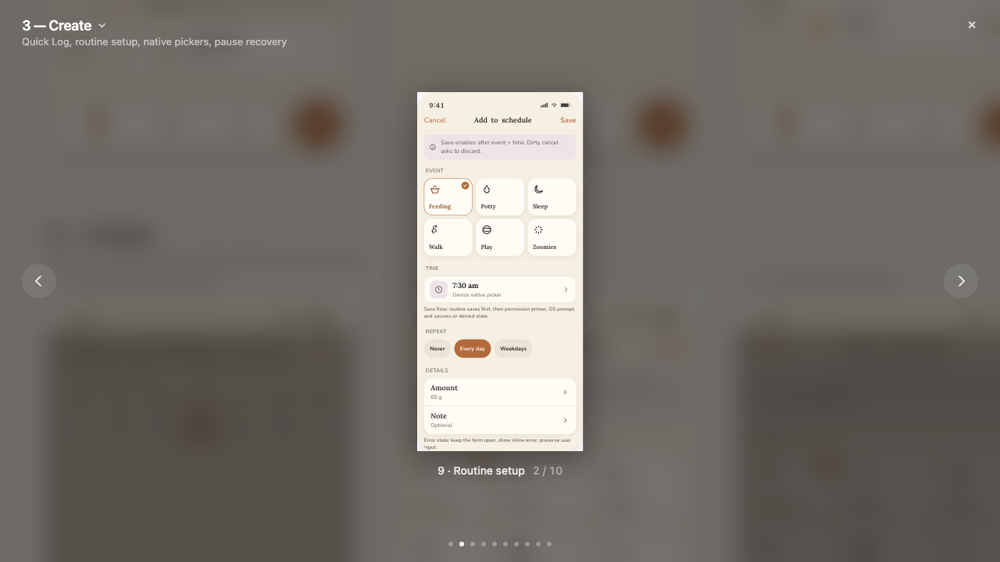
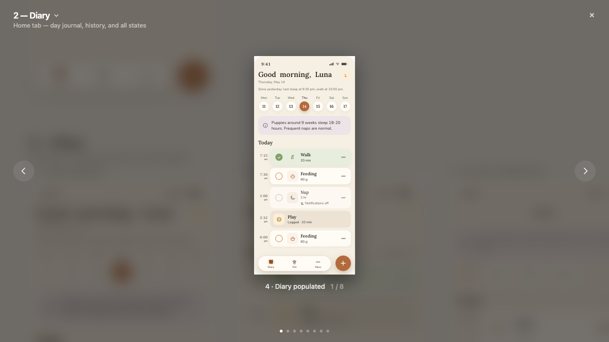
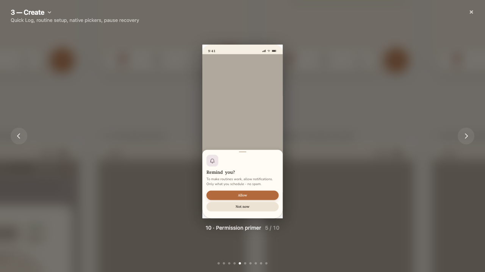
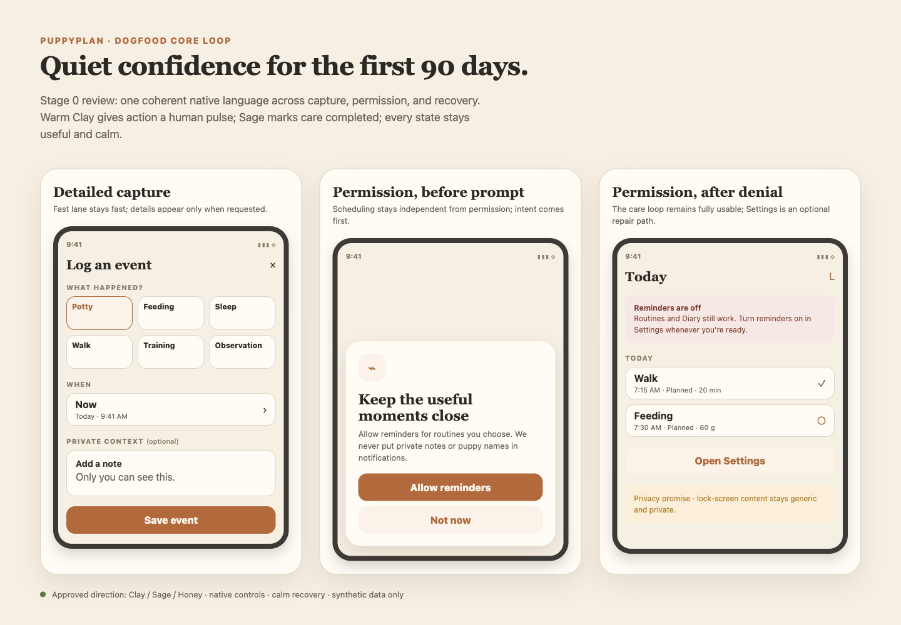

# PuppyPlan Design V2 Screenshot Atlas

Generated from the delivered local package at `<local-downloads>/Puppy app_V2/`. Validate with `docs/design/v2/manifest.json` and a JSON/screenshot existence check.

The screenshots are design references for Expo native implementation and must be treated as synthetic design data.

## Summary

- Sections: 10
- Artboards: 14
- Phone-oriented screenshots: 10
- Reference screenshots: 4
- Dimensions: 924x540 PNG exports

## Foundation

| Atlas ID | State | Dimensions | Screenshot |
| --- | --- | --- | --- |
| `v2.foundation.01` | reference | 924x540 |  |
| `v2.foundation.02` | reference | 924x540 |  |
| `v2.foundation.03` | reference | 924x540 |  |

## Onboarding

| Atlas ID | State | Dimensions | Screenshot |
| --- | --- | --- | --- |
| `v2.onboarding.01` | default | 924x540 |  |
| `v2.onboarding.02` | default | 924x540 |  |

## Quick Log

| Atlas ID | State | Dimensions | Screenshot |
| --- | --- | --- | --- |
| `v2.quicklog.01` | default | 924x540 |  |

## Family And Sharing

| Atlas ID | State | Dimensions | Screenshot |
| --- | --- | --- | --- |
| `v2.family.01` | default | 924x540 |  |

## Health

| Atlas ID | State | Dimensions | Screenshot |
| --- | --- | --- | --- |
| `v2.health.01` | default | 924x540 |  |

## States

| Atlas ID | State | Dimensions | Screenshot |
| --- | --- | --- | --- |
| `v2.states.01` | reference | 924x540 |  |

## Font And Color Checks

| Atlas ID | State | Dimensions | Screenshot |
| --- | --- | --- | --- |
| `v2.checks.lora` | reference | 924x540 |  |
| `v2.checks.warm` | reference | 924x540 |  |

## Profile

| Atlas ID | State | Dimensions | Screenshot |
| --- | --- | --- | --- |
| `v2.profile.01` | default | 924x540 |  |

## Package References

| Atlas ID | State | Dimensions | Screenshot |
| --- | --- | --- | --- |
| `v2.overview.01` | reference | 924x540 |  |
| `v2.print.01` | reference | 924x540 |  |

## Dogfood Core Loop — Stage 0 Review (2026-07-11)

These are fresh local rerenders of the preserved synthetic Miro reference boards. They are review
inputs, not approval. Named deviations and missing variants are tracked in
`../specs/dogfood-core-loop-stage0.md`.

| Stable ID | State | Screenshot |
| --- | --- | --- |
| `dogfood.schedule.01` | create baseline |  |
| `dogfood.diary.01` | mixed plan/fact baseline |  |
| `dogfood.permission.01` | permission primer |  |
| `dogfood.stage0.variants.01` | detailed capture + permission before/after states |  |

## Dogfood Core Loop — Stage 4 Native Evidence (2026-07-11)

Detailed Quick Capture passes native-vs-reference review on the locked iPhone SE simulator. See
[the comparison record](dogfood-core-loop/phase3-stage4-comparison.md) and its five synthetic native
captures.

The Canonical Routine Editor's 2026-07-11 PASS was retracted after owner review
([audit record](dogfood-core-loop/phase4-stage4-comparison.md)); the editor was rebuilt on
2026-07-12 and re-passed with named deviations. See
[the rebuilt comparison record](dogfood-core-loop/phase4-stage4-rebuilt.md) and its synthetic
native captures, which also cover the reworked Diary `RoutineCard` planned rows.

The Diary plan/fact merge passes the locked-SE Stage 4 review. See
[the Diary comparison record](dogfood-core-loop/phase5-stage4-comparison.md), including neutral
past-plan and planned-versus-actual evidence.
