# PuppyPlan Design V2 Screenshot Atlas

Generated from the delivered local package at `/Users/dmitryselenya/Downloads/Puppy app_V2/`. Validate with `docs/design/v2/manifest.json` and a JSON/screenshot existence check.

The screenshots are design references for Expo native implementation and must be treated as synthetic design data.

## Summary

- Sections: 10
- Artboards: 14
- Phone-oriented screenshots: 10
- Reference screenshots: 4
- Dimensions: 924x540 PNG exports

## Foundation

| Atlas ID | State | Dimensions | Screenshot |
| --- | --- | --- | --- |
| `v2.foundation.01` | reference | 924x540 | 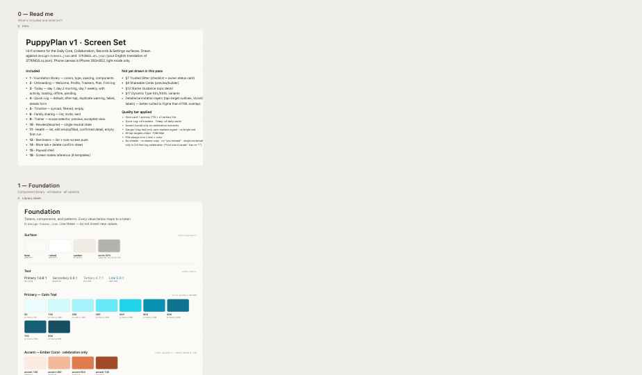 |
| `v2.foundation.02` | reference | 924x540 | 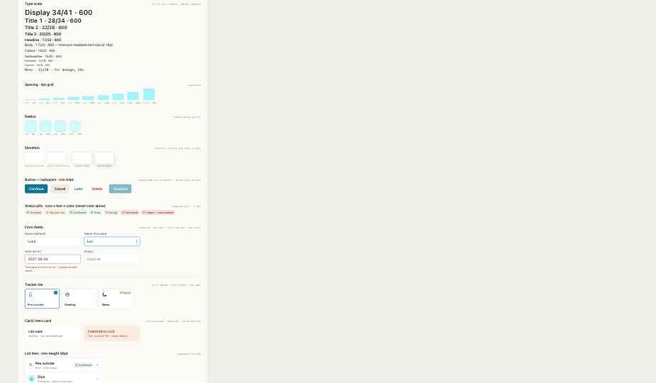 |
| `v2.foundation.03` | reference | 924x540 | 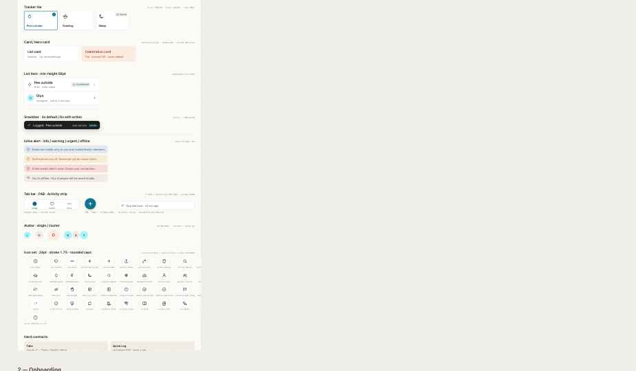 |

## Onboarding

| Atlas ID | State | Dimensions | Screenshot |
| --- | --- | --- | --- |
| `v2.onboarding.01` | default | 924x540 | 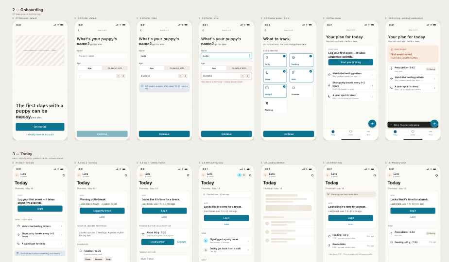 |
| `v2.onboarding.02` | default | 924x540 | 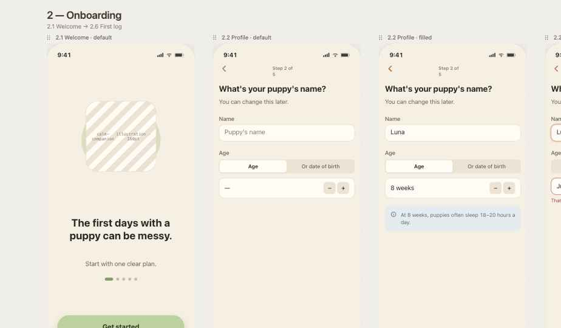 |

## Quick Log

| Atlas ID | State | Dimensions | Screenshot |
| --- | --- | --- | --- |
| `v2.quicklog.01` | default | 924x540 | 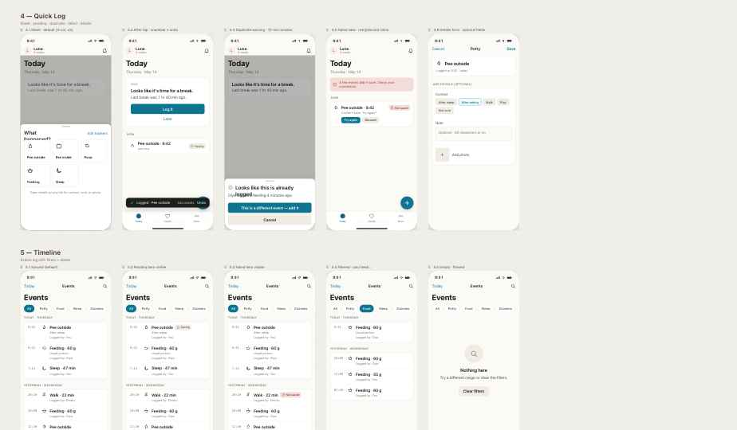 |

## Family And Sharing

| Atlas ID | State | Dimensions | Screenshot |
| --- | --- | --- | --- |
| `v2.family.01` | default | 924x540 | 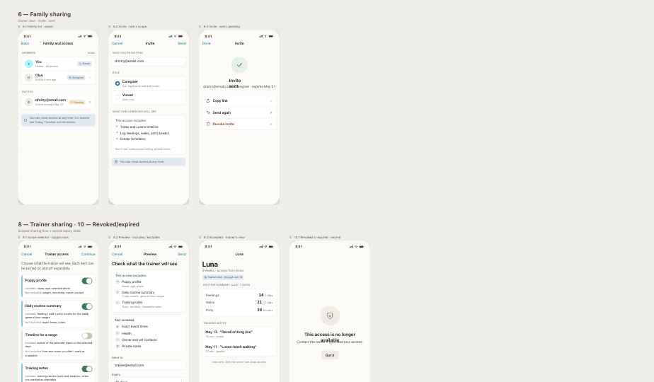 |

## Health

| Atlas ID | State | Dimensions | Screenshot |
| --- | --- | --- | --- |
| `v2.health.01` | default | 924x540 | 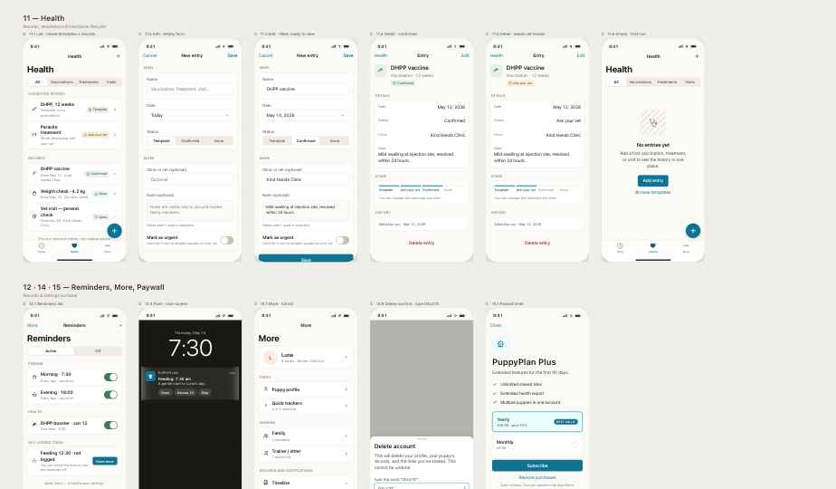 |

## States

| Atlas ID | State | Dimensions | Screenshot |
| --- | --- | --- | --- |
| `v2.states.01` | reference | 924x540 | 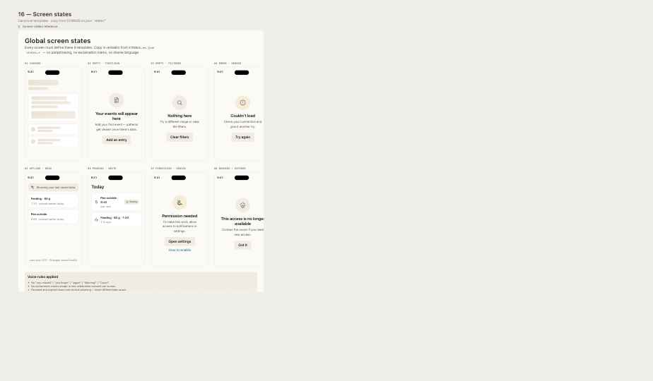 |

## Font And Color Checks

| Atlas ID | State | Dimensions | Screenshot |
| --- | --- | --- | --- |
| `v2.checks.lora` | reference | 924x540 | 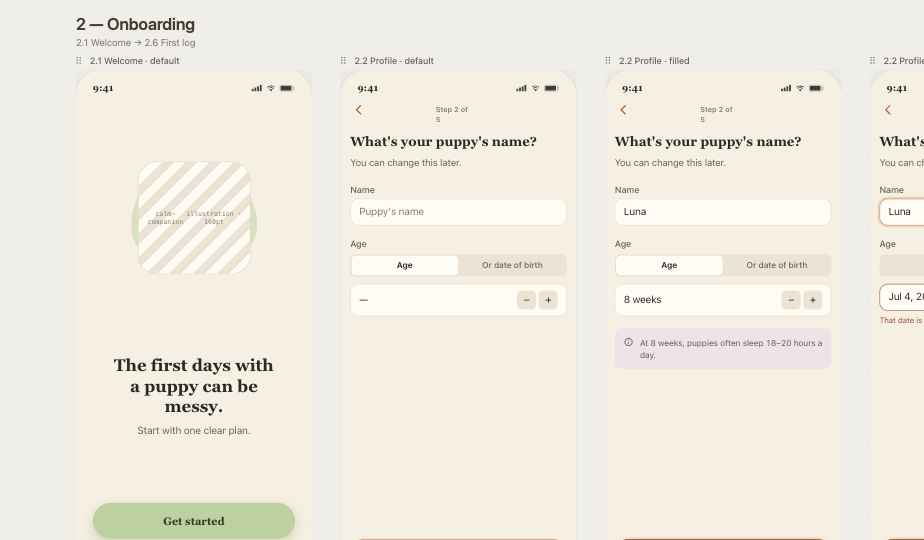 |
| `v2.checks.warm` | reference | 924x540 | 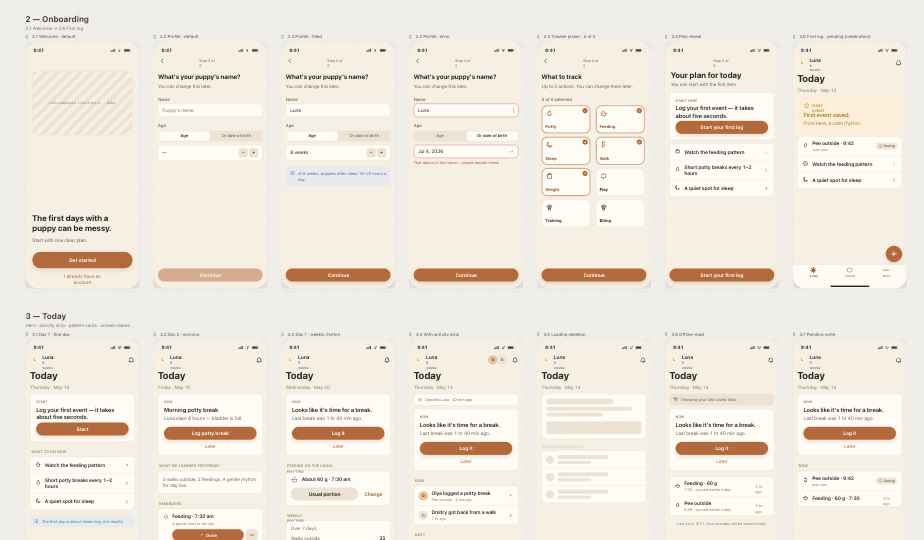 |

## Profile

| Atlas ID | State | Dimensions | Screenshot |
| --- | --- | --- | --- |
| `v2.profile.01` | default | 924x540 | 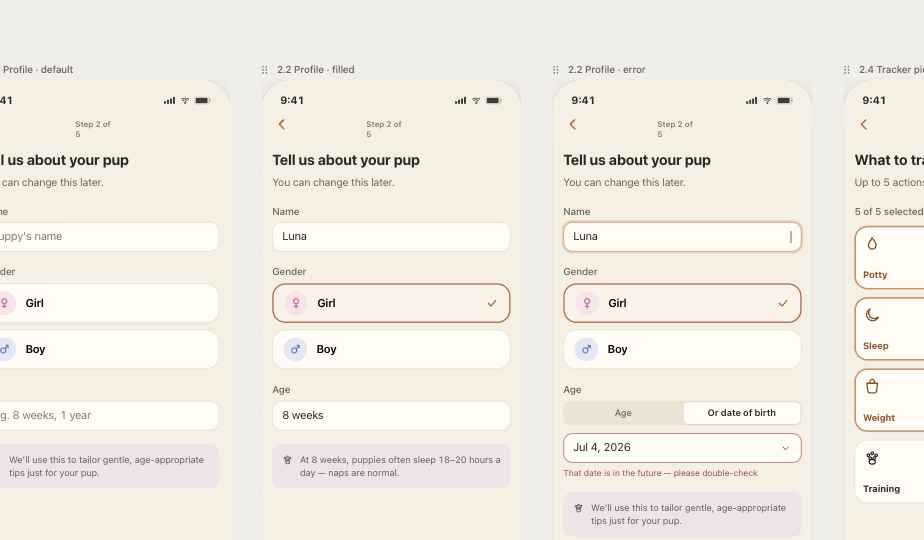 |

## Package References

| Atlas ID | State | Dimensions | Screenshot |
| --- | --- | --- | --- |
| `v2.overview.01` | reference | 924x540 | 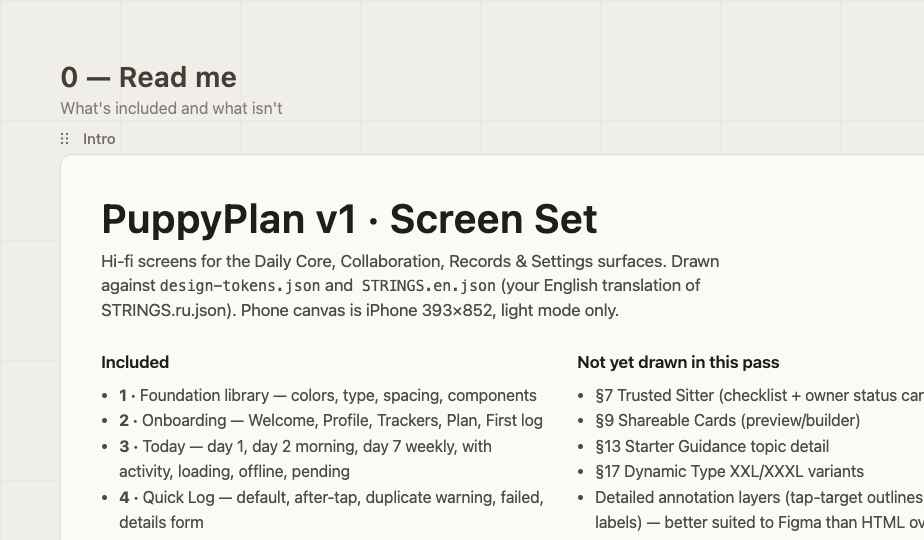 |
| `v2.print.01` | reference | 924x540 | 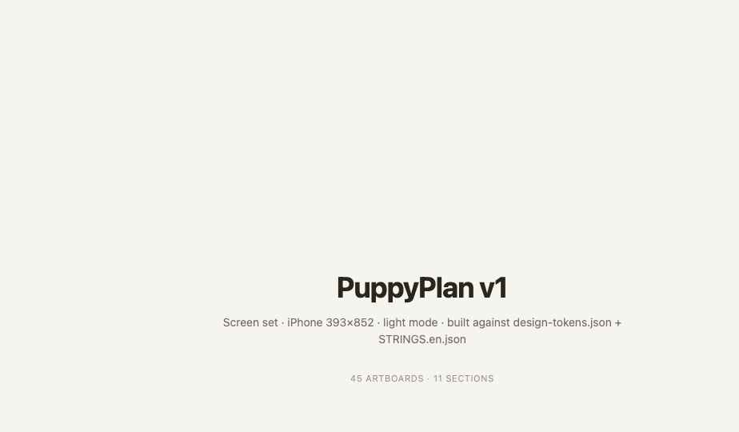 |
